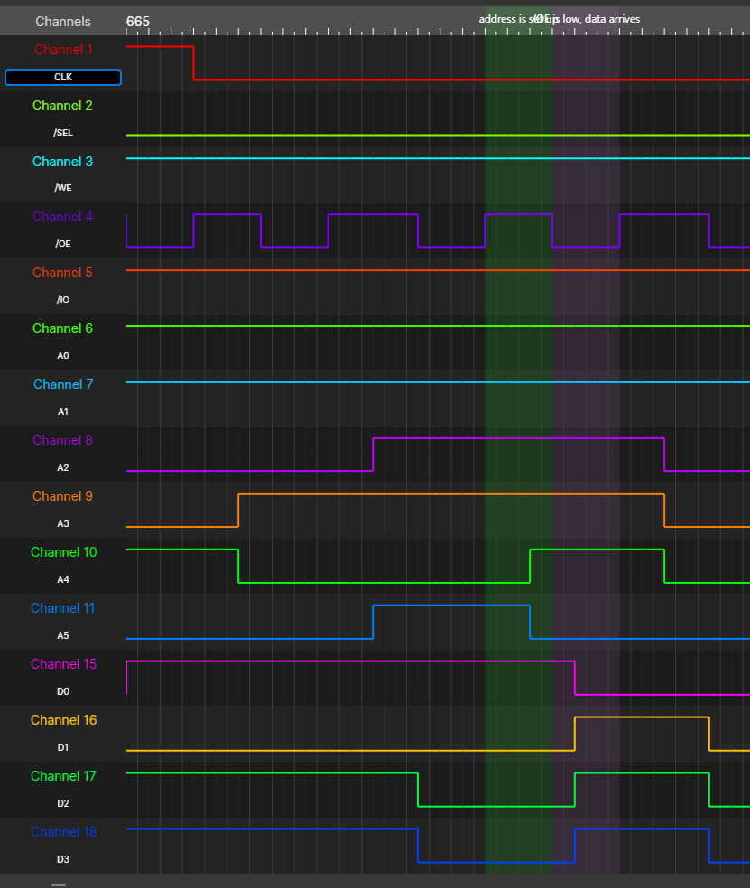
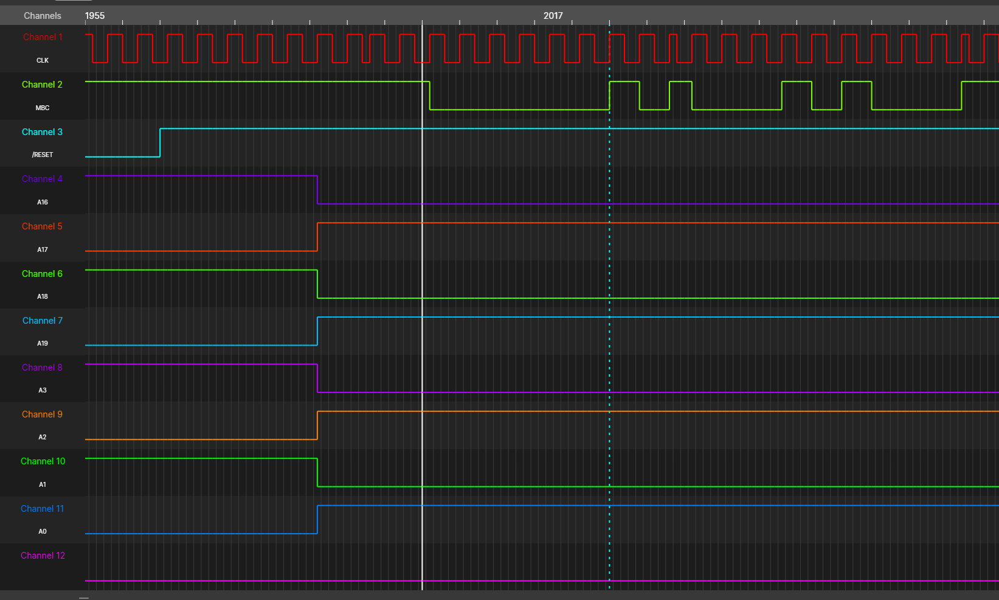

# Retail cartridges

## Construction of WS cartridges

Refer to http://perfectkiosk.net/stsws.html#cart for a pinout of the Wonderswan cartridge bus. Frutratingly WSman has a few pins in its pinout swapped.

Commercially sold Wonderswan games usually contained these components:

* A 16-bit wide ROM chip containing the main game data
* The Bandai chip (either Bandai 2001 or Bandai 2003)

Also optionally either:

* 8-bit wide SRAM for save data, a battery and the GIZA chip
* EEPROM to store save data

Additionally some games contain a real time clock.

Both the ROM and SRAM are connected to the lower 16 address lines and all 16 data lines (ROM), the lower 8 data lines (SRAM), as well as the `/OE` and `/WE` signal.

The Bandai chip is connected to `A0`-`A3`, `A16`-`A19`, `D0`-`D7`, as well as all the control signals. It also serves as a connection serial peripherals like EEPROM or an RTC.

For a schematic of such a cartridge see up-n-atom's [WonderWitch clone](https://github.com/up-n-atom/WonderWitch). Note that the WonderWitch uses a parallel flash memory in place of the ROM chip as it needs to be rewritable.

## Memory access

Both the ROM and the SRAM chip use a standard asynchronous memory interface.

In this trace the CPU access memory repeated. It sets up the address while `/OE` is high (marked in green) and then sets it low, which (marked in pink) is when the Bandai chip will select the right chip, which will then provide the data.

For every memory access the Bandai chip will use the upper address bits (`A16`-`A19`) to select either the ROM or SRAM and provide the upper address bits (beyond the low 16-bits) based on its internal registers which can be set using I/O accesses.

It is presumed that the CPU latches the data to be read on the rising edge of `/OE`.

The byte at the lower address (even) is deliverd on `D0`-`D7` while byte at the upper address (odd) is delivered on `D8`-`D15`.

While the address seems to be applied already before `/WE` or `/OE` are pulled low, the data lines are only set during the falling edge (only confirmed for I/O writes).

So when not using a second clock (which would allow an arbitrary delay), it is probably the best to latch the write value on the rising edge of `/WE`.

## I/O

Cartridge I/O registers are handled by the Bandai chip. They are made like regular memory accesses, except that the `/IO` signal is low during the regular `/OE` or `/WE` is. See again http://perfectkiosk.net/stsws.html#cart for more information.

I/O accesses are 8-bit wide (using `D0`-`D7`) with an 8-bit address. Since the Bandai chip is not connected to the full address bus, the upper four address bits are output on `A16`-`A19`.

## ROM width and self flashing

While SRAM accesses are always 8-bit wide, ROM can be configured to be either [8 or 16-bit wide](http://perfectkiosk.net/stsws.html#hardware_architecture). The 8-bit mode was reportedly never used by any commercial software.

For 16-bit ROMs the address line (`A0`) is not connected to the ROM chip. The SoC seems to rely on this force aligning memory accesses, because it sometimes issues reads with it set, while expecting the word with it ignored.

For rewritable cartridges whether using parallel flash memory like Wonderwitch or PSRAM like the nileswan it is desirable to write to the ROM with software running on the Wonderswan. When doing this two hurdles are encountered:

The first is that the SoC blocks writes to ROM from even going to the bus. This problem is solved by Bandai 2003 which gains the ability to set which memory (SRAM or ROM) is selected when accessing the SRAM area (0x10000-0x1FFFF) via the self flash register.

The second is the aforementioned limitation of the SRAM area which only allows 8-bit access size, while ROMs are usually 16-bit wide (which is advantagous due to bigger transfer size). Bandai 2003 again solves this in combination with special NOR flash memory which has a pin to decide whether a memory access is done width 8 or 16-bit width. When the Bandai 2003 is in self flash mode and SRAM is accessed it asserts the `/BYTE` signal of the flash memory. The least significant address bit `A0` is transfered from Bandai 2003 to `D15` of the flash memory which serves its secondary function as `A0` here. As only `D0`-`D7` carry data there is no conflict.

## Reset signal

After power up a monochrome Wonderswan `/RESET` stays low for about 18 ms.

Pulling it low again with an open drain I/O leads to a current of 1 mA on a monochrome Wonderswan and 4.9 mA on a color Wonderswan.

The reason, this can be important, is, that some FPGAs or microcontrollers need longer to initialise. Pulling the reset signal low again once they are done might be a viable option for them.

## Unlocking

Shortly after `/RESET` goes high again a handshake between the SoC (CPU) and the Bandai chip is performed. If it is not sucessful, the bootrom will refuse to load the game and not even show the Bandai logo.

The opening sequence is synchronous to the serial clock signal. It begins after the the rising edge of the clock when `A0`-`A3` become 0x5 and and `A16`-`A19` become 0xA. On each subsequent rising edge a bit will be output via `MBC`. The sequence is (lowest bit output first) 0b1000101000101000000111. Afterwards `MBC` stays high indefinitely and is not used anymore until the system is reset.

It seems like there is some allowed variance in the number of cycles before the first low MBC value. Though how it is depicted in the trace (where it is output during the fourth rising edge after the rising edge with the address change) is how official Bandai chips seem to behave.

## Serial clock

The positive edge of the serial clock seems to always coincide with the positive edge of bus control signals `/OE` or `/WE`. This makes it easy to latch on either signals without having to fear timing violations.

## Speed requirements

Generally speaking the `/OE` or `/WE` signal seem to go low and high again with a frequency of about 3 MHz which is probably derived from the 12.288MHz system clock. This leaves half the period, so about 162 ns to handle one memory access.

## Power consumption

See [current consumption](current_consumption.md) for my experiments regarding this.

## Mechanical details

|Distance|Length (in mm)|
|------|-----------------|
|Distance pad to pad|1.25|
|Left edge to first pad|0.7|
|Last pad to right edge|0.95|
|Bottom edge to longer pads (GND, Vcc)|0.5|
|Bottom edge to shorter pads|1|

TODO: make a proper mechanical drawing